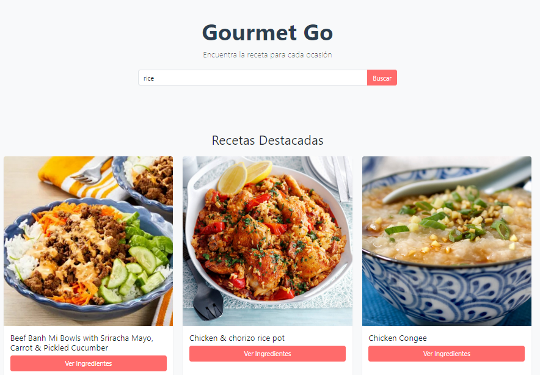

###  Buscador de Recetas (EF-M3_Proyecto-Integrador-Sprint_1)


# Buscador de Recetas Dinámico 🍳



## 📝 Descripción
Aplicación web *Single Page Application* (SPA) ligera que consume una API RESTful externa para consultar recetas en tiempo real. El proyecto demuestra el manejo asíncrono de datos (`async/await`), manipulación del DOM y gestión del estado en el cliente utilizando exclusivamente Vanilla JavaScript.

🔗 **[Ver Demo en Vivo](https://krypo23.github.io/EF-M3_Proyecto-Integrador-Sprint_1/)**

## 🛠️ Tecnologías Utilizadas


## ⚙️ Instalación y Uso Local

1. Clona este repositorio:
   ```bash
   git clone [https://github.com/krypo23/EF-M3_Proyecto-Integrador-Sprint_1.git](https://github.com/krypo23/EF-M3_Proyecto-Integrador-Sprint_1.git)